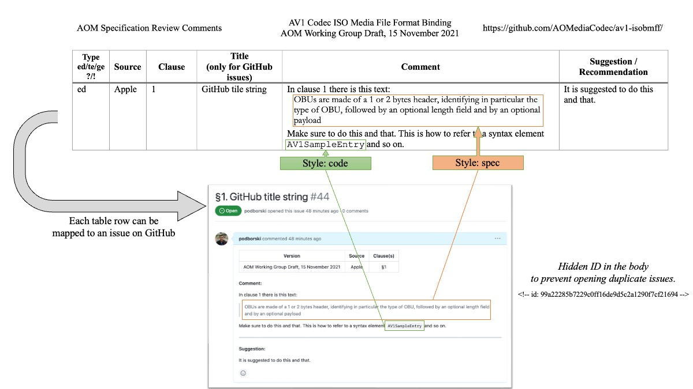

# Additional information on how to provide comments

In this readme we provide additional information on how to write the entries in the word document. Use the [AOM_comments_template.docx](./data/AOM_comments_template.docx) file as a starting point and rename it to represent the specification you want to review. 

For example, if you are providing comments to the [AV1 Codec ISO Media File Format Binding](https://aomediacodec.github.io/av1-isobmff/) specification, you can name your file `AOM_comments_AV1_ISOBMFF.docx`.

## Fill out the headers

First, fill out the table headers.

- [Spec name goes here] &rarr; Specification name as written in the document
- [Spec version goes here] &rarr; Specification version which was used to collect comments
- [GitHub URL goes here] &rarr; GitHub URL of the project which can be used to track the progress of the comments.

After that you can start gathering comments to that version of the specificaion.

## How to write comments

### Styles
The provided template has 3 styles which you can use when preparing your feedback.

- `Normal`: Your comment
- `code`: Syntax elements
- `spec`: Use this style to quote parts of the spec.

Make sure you don't copy other styles into the document. Use only the 3 styles listed above whenever possible.

### Comment types
We define several comment types:

- `ed`: Editorial which will be linked to `editorial` label wehen opening issues on GitHub
- `te`: Technical which will be linked to `technical` label wehen opening issues on GitHub
- `ge`: General which will be linked to `general` label wehen opening issues on GitHub
- `?`: Question which will be linked to `question` label wehen opening issues on GitHub
- `!`: AOM internal discussion only, when putting this into the comment type no issue will be opened.

You can combine multiple types by separating them with a comma like this: `ed, ?`.

## Example

For example for the [AV1 Codec ISO Media File Format Binding](https://aomediacodec.github.io/av1-isobmff/) specification, you would replace:

- [Spec name goes here] &rarr; `AV1 Codec ISO Media File Format Binding`
- [Spec version goes here] &rarr; `AOM Working Group Draft, 15 November 2021` 
- [GitHub URL goes here] &rarr; `https://github.com/AOMediaCodec/av1-isobmff/`

And then provide comments using the styles and comment types defined above.

